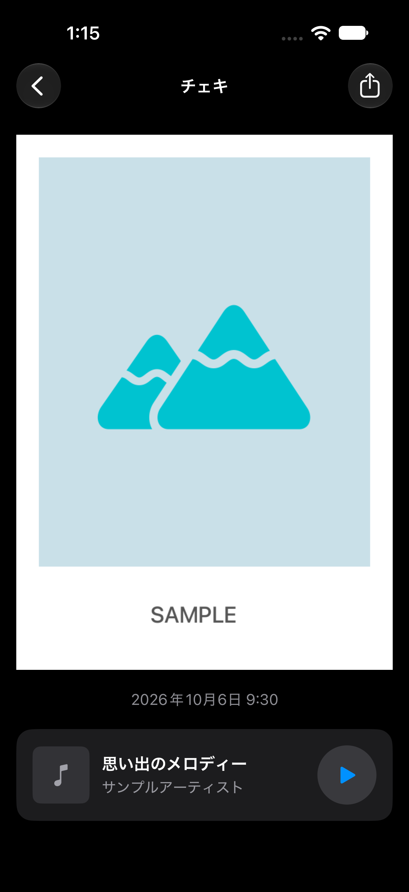
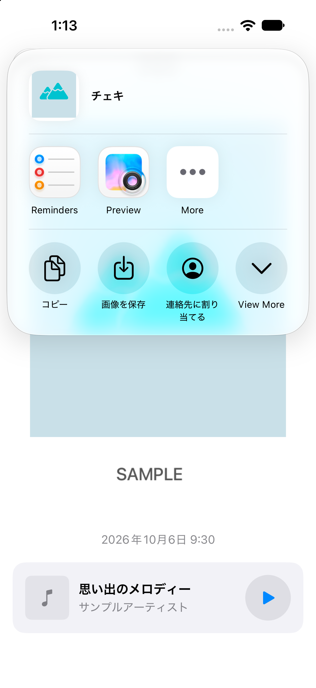
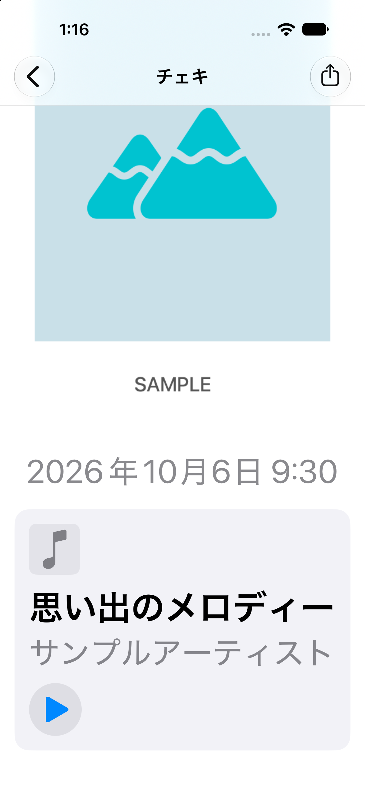
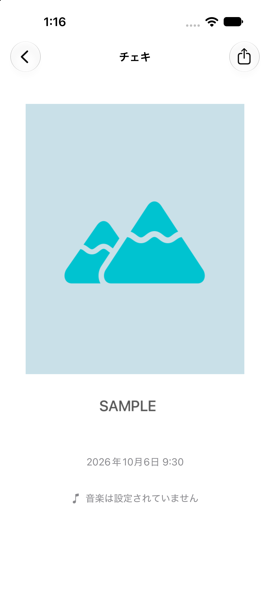
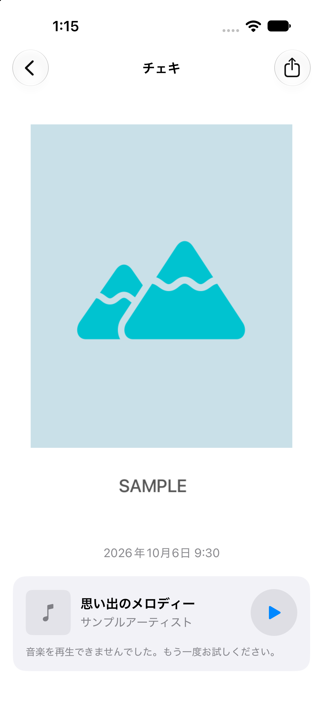

# チェキ詳細画面の確認記録

2026年10月6日、iPhone 18 Pro / iOS 27.0 の専用シミュレーターで確認しました。

## 確認方法

`PIcTune`スキームのアプリ全体のビルドと単体テストを実行し、6件すべて成功しました。

スクリーンショットは、実装した`ImageDetailView`にサンプル画像・日付・曲情報を渡したアプリを動かして撮影しています。画面確認のために一時的に変更した起動コードとデータ取得処理は元に戻しており、PRには含めていません。実際の写真やアカウント情報は使用していません。

## 確認結果

- ライト表示とダーク表示で、チェキ全体・日付・曲情報・共有操作を表示できました。
- Dynamic Typeのアクセシビリティサイズ（accessibility3）では音楽の行が縦並びになり、スクロールして再生ボタンまで操作できました。
- 共有シートに「画像を保存」が表示されました。写真への追加許可を求めるダイアログで許可後、写真ライブラリにPNGが保存されました。
- 保存されたサンプルPNGを確認し、元と同じ600×850ピクセルで、枠と下部の文字が欠けていないことを確認しました。
- 音楽未設定の場合は「音楽は設定されていません」と表示されました。
- 試聴URLがない場合は「この曲は試聴できません」と表示され、再生ボタンは表示されませんでした。
- 失敗する試聴URLを指定して再生ボタンを押すと、エラーメッセージが表示され、試聴ボタンに戻りました。

## スクリーンショット

| ライト | ダーク | 共有 |
| --- | --- | --- |
|  |  |  |

| 大きな文字・スクロール後 | 音楽未設定 | 再生失敗 |
| --- | --- | --- |
|  |  |  |

## 未確認事項

実機での表示・保存、写真への追加許可を拒否した場合、Firestoreの実データ取得、有効な楽曲URLでの再生・一時停止・最後まで再生した場合の動作は未確認です。既存の6件の単体テストは写真保存と音楽検索に関するもので、チェキ詳細画面のUIテストではありません。
