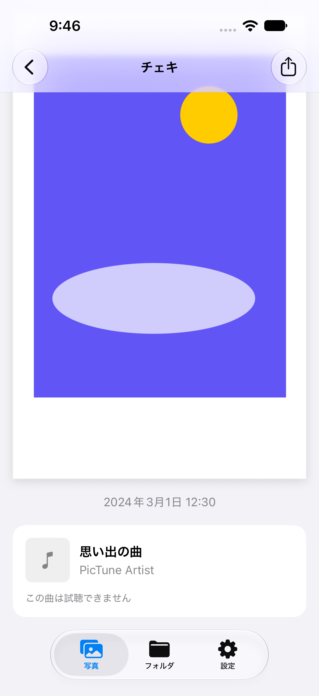
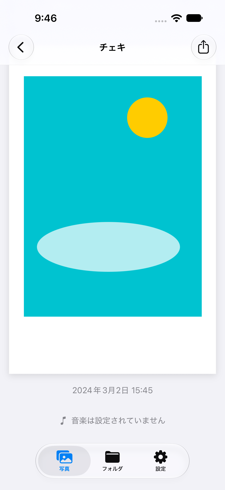

# チェキ詳細画面の確認記録

2026年10月6日、iPhone 18 Pro / iOS 27.0 の専用シミュレーターで確認しました。

## 確認方法

`PIcTune`スキームでmain統合後のアプリをビルドし、単体テスト29件と写真一覧・詳細のUIテスト1件が成功しました。音楽あり・なしの2枚を順に開き、各写真の日付・楽曲情報・共有ボタンと、スクロールして補足情報を表示できることを確認しています。

初回確認のスクリーンショットは、実装した`ImageDetailView`にサンプル画像・日付・曲情報を渡したアプリを動かして撮影しています。画面確認のために一時的に変更した起動コードとデータ取得処理は元に戻しており、PRには含めていません。実際の写真やアカウント情報は使用していません。

## 確認結果

main統合後は`LibraryPhoto`から画像・日付・楽曲を受け取り、詳細画面でFirestoreを再取得しません。UIテストにはmainに追加されたローカル専用データを使い、以下の画像を撮影しました（スクロール後）。

| 音楽あり | 音楽なし |
| --- | --- |
|  |  |

以下は統合前の表示・保存・再生確認の記録です。

- ライト表示とダーク表示で、チェキ全体・日付・曲情報・共有操作を表示できました。
- 背景をシステムのグループ背景色に変更し、チェキに細い輪郭と控えめな影を追加しました。ライト・ダーク表示で白い枠の境界を再確認しました。これらの装飾は画面上の表示のみで、共有するPNGには加えません。
- Dynamic Typeのアクセシビリティサイズ（accessibility3）では音楽の行が縦並びになり、スクロールして再生ボタンまで操作できました。
- 共有シートに「画像を保存」が表示されました。写真への追加許可を求めるダイアログで許可後、写真ライブラリにPNGが保存されました。
- 保存されたサンプルPNGを確認し、元と同じ600×850ピクセルで、枠と下部の文字が欠けていないことを確認しました。
- 音楽未設定の場合は「音楽は設定されていません」と表示されました。
- 試聴URLがない場合は「この曲は試聴できません」と表示され、再生ボタンは表示されませんでした。
- 失敗する試聴URLを指定して再生ボタンを押すと、エラーメッセージが表示され、試聴ボタンに戻りました。

## スクリーンショット

ライト・ダークの画像は背景と境界の調整後に再撮影しました。その他は調整前の機能確認時の画像です。

| ライト | ダーク | 共有 |
| --- | --- | --- |
|  |  |  |

| 大きな文字・スクロール後 | 音楽未設定 | 再生失敗 |
| --- | --- | --- |
|  |  |  |

## 未確認事項

実機での表示・保存、写真への追加許可を拒否した場合、Firestoreの実データ取得、有効な楽曲URLでの再生・一時停止・最後まで再生した場合の動作は未確認です。統合後の29件の単体テストには写真とメタデータの対応を検証するテストが含まれ、詳細画面は上記UIテストで確認しています。
