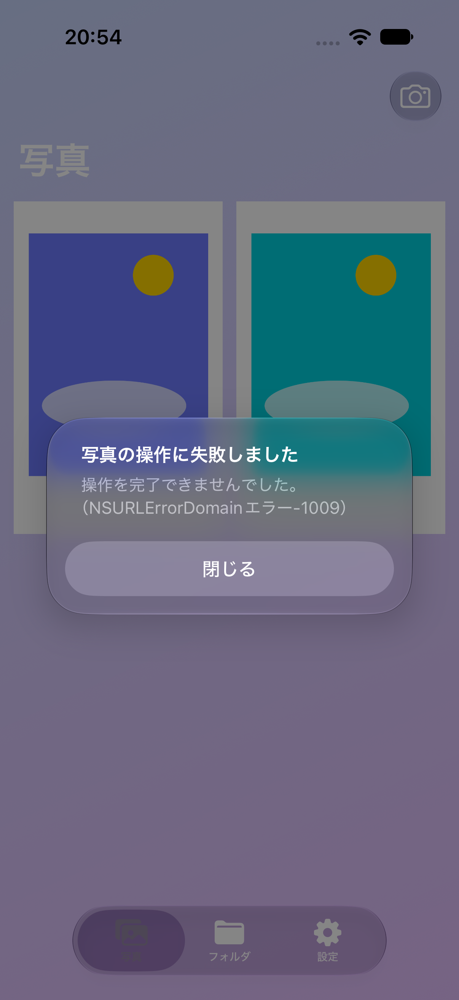
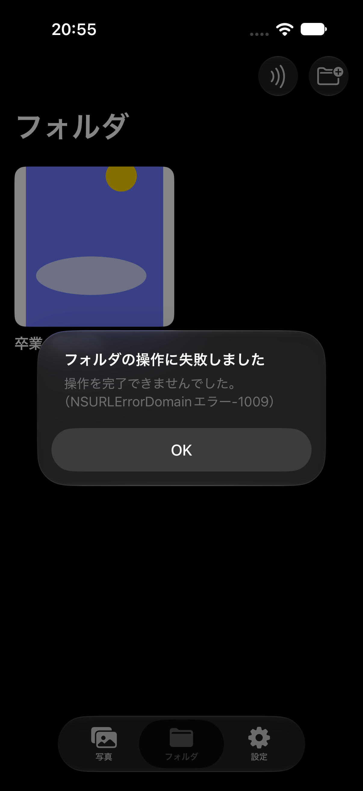
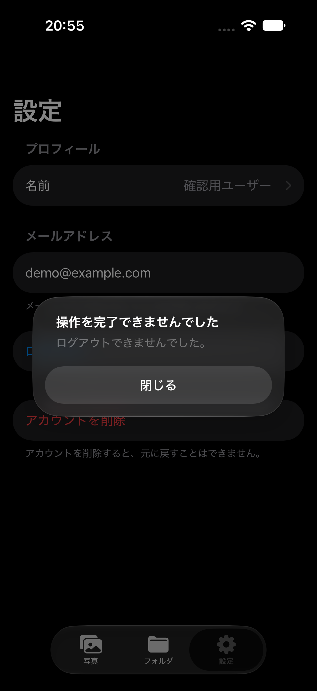

# PicTune 不具合調査・修正（2026年10月6日）

認証、写真撮影・加工・保存、一覧・フォルダ・手紙、QR/NFC共有、音楽検索・試聴、写真書き出し、Widgetを調査しました。実装を読んで確認できた不具合を修正し、失敗・再試行・アカウント切替・非同期処理の競合に対する回帰テストを追加しています。すべての環境で不具合がないことを保証するものではありません。

## 修正内容

| 領域 | 発生条件と修正後の挙動 |
| --- | --- |
| プロフィール | 再ログインで編集済みの名前を上書きしていた処理を、transactionによる欠損フィールドの補完に変更しました。認証リスナーをセッション側に集約し、解除漏れも修正しました。 |
| アカウント削除 | Appleの再認証完了前に失効・削除へ進む処理を直列化し、トークン欠損時の強制アンラップを除去しました。Googleは新しい認証を行い、複数プロバイダーの同時処理や二重実行を防ぎます。失敗は画面に表示します。 |
| アカウント切替 | 写真・フォルダ・手紙・画面遷移・Widgetをリセットし、古い非同期読み込み・削除・表紙取得の完了結果を破棄します。同じユーザーの通常起動時はWidgetの共有URLを保持します。未ログインでの追加・削除を成功扱いにしません。 |
| QR | URLやFirestoreパスなどの不正値を通信前に拒否します。読み取り・プロフィール確認に失敗した場合はカメラへ進まず、古いプロフィール取得結果も破棄し、保存後は実際に表示中のカメラを閉じます。 |
| カメラ | 設定・起動・停止・撮影を同じキューで実行し、設定終了漏れと連写時のLive Photoデータ混線を防ぎます。画像の切り出しは画像ピクセルとプレビュー範囲を使用し、意図しない微小回転を除去しました。 |
| 撮影画面の再表示 | 前回の画像・編集シート状態を消し、閉じた画面から遅れて届く撮影プレビューを破棄します。保存途中の認証変更を確認し、異なるアカウントの画面状態を更新しません。 |
| NFCレコード | 旧版との相互運用のため、書き込みは従来と同じ単一raw UTF-8レコードを維持します。読み込みは従来形式・標準Textレコードの両方に対応します。非対応端末・失敗・キャンセルを通知し、未開始セッションの終了でクラッシュしません。 |
| NFC取り込み | 存在しない共有元・自分自身・不正参照を拒否します。送信者とフォルダを含む取り込み先ID、元の写真IDを使うため、別フォルダの上書きや再試行時の重複を防ぎます。受信者が編集した手紙は再取り込みでも保持します。 |
| 大きな共有フォルダ | 400件ずつコピーし、新規フォルダは写真のコピーが完了してから一覧に公開します。途中失敗後も同じIDで再試行できます。 |
| フォルダ削除 | 親ドキュメントだけでなくphotosサブコレクションも400件ずつ削除します。元写真・別フォルダ・他ユーザーと共有するStorage画像は削除しません。 |
| 写真の追加 | 同じ写真を同じフォルダへ再追加しても重複しません。元写真がない場合は明示的に失敗します。 |
| フォルダ作成 | 作成と一覧取得が競合しても二重表示しません。空の名前を拒否し、作成失敗・写真操作失敗を画面に表示します。 |
| 日付更新 | 既存ユーザーフィールドを消さずに更新し、全写真フォルダが欠損していても復旧します。 |
| Widget | 未設定・写真1〜2枚・不正URL・通信失敗・破損画像でのクラッシュを修正しました。非同期取得を使用し、現在時刻から表示します。削除・ログアウトで共有URLを消し、取得中に共有情報が変わった場合は旧画像を破棄します。 |
| 音楽検索 | キャンセル非対応の検索が後から成功した場合にも、検索中表示を解除します。 |
| ビルド設定 | Widgetのビルド番号・バージョンをアプリと一致させました。 |

## 検証環境・結果

- Xcode 27.2 beta 2、専用 iPhone 18 Pro シミュレーター「PicTune Bug Audit」、iOS 27.0。
- アプリ・Widget・単体テスト・UIテストを、共有スキーム `PIcTune` でビルドします。
- Firestore統合テストはローカル `127.0.0.1:8089` / `demo-pictune-audit` のみへ接続します。エミュレーター未起動時は明示的にスキップします。
- 401枚の取り込みとサブコレクション削除、取り込み再実行、部分コピーからの再試行、既存フォルダと編集済み手紙の保持、写真のID・楽曲・未知フィールド保持を確認対象としています。
- UIは固定データを使用し、本番の写真・アカウントを変更しません。

最終結果: **単体・Firestore統合テスト77件成功、UIテスト10件成功・実Apple Music接続テスト1件スキップ、失敗0件**。アプリ・Widget・テストターゲットのDebugビルドも成功しました。追加した回帰テストは単体/統合38件とUI1件です。`git diff --check` も成功しています。

ビルド済みアプリとWidgetの `CFBundleShortVersionString` はともに `1.04`、`CFBundleVersion` はともに `5` と確認しました。

以下は最終UIテストから保存した画面です。写真・フォルダ・設定の失敗通知を、iPhone 18 Pro（iOS 27.0）で確認しました。表示データとエラーはテスト用の固定データです。

| 写真操作の失敗 | フォルダ作成の失敗 | 設定操作の失敗 |
| --- | --- | --- |
|  |  |  |

## 未確認事項・制約

- 実機でのカメラ、QR、NFCカード読み書き、Live Photo保存、撮影プレビューと切り出しの一致。
- 実機署名・Release配布、実際のApple/Google/メール認証、ログアウト・アカウント削除、Apple Musicの実通信・実音源再生、実機ホーム画面上のWidget。
- Firestoreエミュレーターはクライアントのデータ操作を検証するもので、本番Security Rules、ネットワーク障害、他端末の同時書き込みまでは再現していません。
- アカウント削除後のFirestore/Storageの一括清掃は、共有画像の所有権とバックエンドの削除処理をこのリポジトリから確認できないため、今回追加していません。認証アカウントの削除と保存済みデータの完全消去は別の確認事項です。
- Storage上の画像は他フォルダ・共有先でも参照されるため、写真/フォルダ削除時の画像本体の一括削除は行いません。
- 旧方式で取り込んだフォルダは自動移行・削除しません。同じNFCカードを修正後に初めて取り込むと、新方式の取り込み先フォルダが別に作られる場合があります。
- 400件を超える取り込み・削除は複数バッチです。全体が一つの原子的操作になるわけではなく、途中で失敗した場合は再試行が必要です。
- Live Photoのクラウド連携は未完成の経路が残ります。動画ファイルを使う処理へ修正しましたが、一連の機能を完成・実機確認済みとは扱いません。

## 既存ユーザー互換性の追加確認（2026年10月7日）

最終結果: **単体・Firestore統合テスト82件成功、失敗0件・スキップ0件**。追加した互換性テスト5件を含みます。xcodemcpの `xcode_test` でPIcTuneスキームを実行し、同MCPの `xcresult_summary` で成功を確認しました。MCPのビルドログ解析にはエラーが出ますが、Xcodeのビルド記録と確定したxcresultにはエラーがありません。今回はUI変更がないため、最終実行は単体・統合テストを直列で実行し、UIテストは対象外です。一時的なスキーム設定は検証後に元に戻しました。

- 実行環境: Xcode 27.2 beta 2、iPhone 18 Pro「PicTune Bug Audit」、iOS 27.0。
- 結果: `~/Library/Developer/Xcode/DerivedData/PIcTune-avditvfupxztcrfwbwfcuqjwyyig/Logs/Test/Test-PIcTune-2026.10.07_08-38-53-+0900.xcresult`。

- 旧版のNFC読み取りはTextレコードのヘッダーもユーザーIDとして解釈するため、標準形式の書き込みでは旧版から共有を受け取れないことを確認しました。書き込みを従来形式に戻し、生成したNDEFメッセージを旧版と同じデコード処理・新版の両方で読む回帰テストを追加しました。標準形式の読み取り対応は維持しています。
- プロフィール初期化処理にローカルFirestoreを注入できるようにし、既存プロフィール・全写真フォルダ・写真が再初期化で変わらないこと、不完全なプロフィールと欠損した全写真フォルダを既存写真を残して補完することを統合テストに追加しました。
- 旧形式の写真・Spotify情報・Live Photoファイル名・手紙・任意フィールドを持つデータで、読み取り・手紙編集・写真コピーを統合テストに追加しました。
- 2024年2月13日の履歴 `89748f8` と比較し、Firebase設定、Bundle ID、Team ID、App Group、主なFirestore保存先・フィールドとStorageパスを維持していることを確認しました。ただし配布版を特定するGitタグはなく、このコミットが現在のApp Store配布版と同一とは確認できません。
- 現行アプリの最低OSはiOS 18.0です。これは2024年11月6日の `2180f11` からの設定で、今回変更していません。iOS 17の既存ユーザーはこの版へ更新できません。
- 本番ユーザーのデータは使用・変更していません。実際の配布版からの上書き更新、認証セッションの引き継ぎ、本番Security Rules、実機のNFC読み書きは未確認です。保存形式の互換テストと実際の配布アップデート検証は区別しています。

## 再実行

Firestoreエミュレーターをポート8089、プロジェクトID `demo-pictune-audit` で起動してから、以下を実行します。

```sh
xcodebuild -project PIcTune.xcodeproj -scheme PIcTune -configuration Debug \
  -destination 'platform=iOS Simulator,id=<検証用シミュレーターID>' \
  -parallel-testing-enabled NO -resultBundlePath /tmp/pictune-bug-audit.xcresult \
  test CODE_SIGNING_ALLOWED=NO
```

実Apple Music接続テストは既存のオプトイン制御を維持しており、通常のテストではスキップします。
