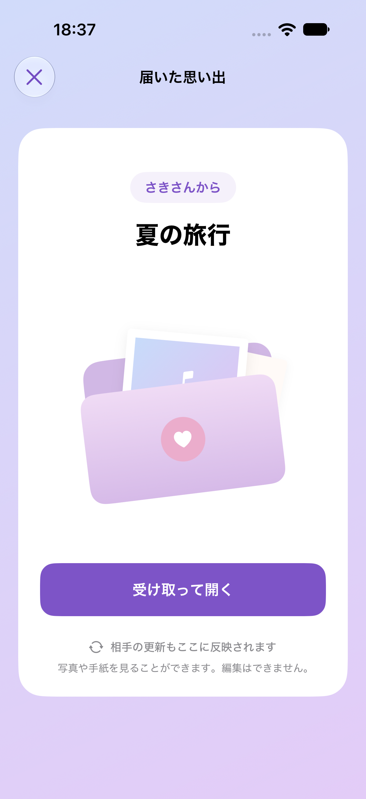
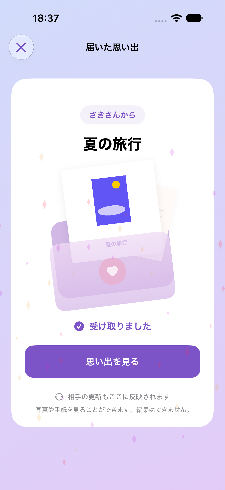
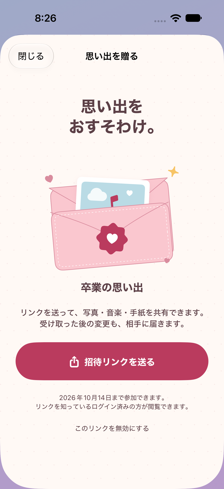

# 招待リンク・開封アニメーションの確認

確認日: 2026-10-06〜2026-10-07（日本時間）

## 画面

初期企画資料の「チェキ×音楽×プレゼント」に合わせ、水色〜紫の背景と白い台紙、太めの文字、チェキと便箋を入れた封筒で送受信画面を統一しています。送信画面には読み込み済みのフォルダ表紙を表示し、受信画面は受け取り成功後に開封とキラキラの演出を表示します。受信画面では参加完了後にフォルダ一覧と同じ順序の1枚目のチェキを読み込み、封筒のカードに表示します。写真は1枚だけ読み込み、写真なし・読込失敗時は音符の表示を残してフォルダを開けます。参加前の写真取得は行いません。

操作は「リンクで送る」「受け取って開く」「思い出を見る」、一覧は「届いた思い出」と表示します。更新の同期・閲覧専用・リンクの公開範囲の説明は残しています。受信画面は開封前後でボタン位置を維持し、共有内容は便箋とチェキの形で表示します。

Xcode 27.2 beta 2 / iPhone 18 Pro / iOS 27.0 の専用シミュレーター「PicTune Model Review」。写真・送り主名は確認用の架空データです。

| 招待を受け取る | 開封時の演出 | 招待リンクを送る |
| --- | --- | --- |
|  |  |  |

[開封時の画面](opened.png) / [共有フォルダと手紙](shared-folder.png)

## 確認結果

- `PIcTune.xcodeproj` / 共有スキーム `PIcTune` のDebugビルド成功。
- 単体テスト43件成功。既存の写真・楽曲・フォルダ関連の回帰確認に加え、招待URLの厳密な検証、ログイン前の招待保持と再起動、期限切れ、受け取り失敗後の再試行・重複防止を確認。
- UIテスト4件成功。招待作成・無効化、期限切れ、通信失敗時に成功演出を出さないこと、開封して共有フォルダを表示すること、表示中の手紙更新を確認。UIテストの通信処理はテスト用Repositoryです。
- 見た目の調整後、開封・送信のUIテスト2件を再実行して成功。最終の受信一覧リスナー・暗号学的トークン生成を含めてビルドと単体43件を再実行し成功。
- Firestore/Storageエミュレーターのアクセス制御テスト9件成功。匿名拒否、招待一覧取得拒否、不正な参加・画像参照の拒否、同一招待の再参加、手紙・曲の閲覧と編集拒否、期限切れ・無効化・元フォルダ削除、共有画像、QRによる相手への保存（写真未作成の新規ユーザーを含む）、所有者付きの画像アップロードを確認。
- 最新mainの写真詳細改善を統合後、単体43件と招待作成・開封・写真詳細のUIテスト3件を再実行して成功。
- 2026-10-07: 送り主・フォルダ名を主役にした画面で、招待作成・無効化、期限切れ、通信失敗、開封と同期のUIテスト4件が成功。最終の文字色調整後にも送信・開封の2件を再実行し成功。掲載画像は最終画面です。
- 2026-10-07: 文面のみの調整後、招待作成・無効化と開封・手紙の同期のUIテスト2件が成功。送信・受信・共有フォルダの文章の折り返しを確認し、掲載画像を更新。配色・フォント・アニメーションは変更していません。
- 2026-10-07: 受信画面と共有フォルダの調整後、開封・手紙の同期、期限切れ、通信失敗のUIテスト3件が成功。受け取り前後のボタン位置、説明文と手紙の表示をシミュレーター画像で確認。受信・開封・共有フォルダの掲載画像を更新。
- 2026-10-07: 初期企画資料に合わせた送受信画面・共有内容の調整後、招待作成・無効化、開封・手紙の同期、期限切れ、通信失敗のUIテスト4件が成功。送信表紙、チェキと便箋の開封、文章の折り返しを確認し、掲載画像4枚を更新。ダークモードの受信画面も確認し、文字色調整後にも送信・開封の2件を再実行し成功。
- 2026-10-07: 受け取り後の1枚目のチェキ表示を追加。関連単体テスト8件、UIテスト3件が成功。先頭画像だけの読み込み、写真削除による表紙のクリア、参加前・参加失敗時は写真を表示しないこと、写真なし・画像取得失敗時も手紙を開けることを確認。最新の開封画像を掲載。
- `git diff --check` 成功。

## 本番への反映

- Firebase Hostingに案内ページと `.well-known/apple-app-site-association` を公開し、HTTPS取得を確認。2026-10-07の案内文更新も公開し、HTTPSで新しい文面を確認。
- 既存の写真ドキュメント367件から参照を調べ、526件の画像所有権レコードを作成。Storageオブジェクト531件のメタデータを更新。画像本体・写真ドキュメントは変更・削除していません。
- 更新前のメタデータは `/tmp/pictune-image-access-backup-20261006-204306.json` にバックアップ。
- Firestore・Storageの招待制ルールを本番へ反映済み。
- 明示承認を受け、Storageサービスアカウントに `roles/firebaserules.firestoreServiceAgent` を付与済み。
- 本番の一時アカウント3件で、画像アップロード、招待への参加、手紙のリアルタイム同期、受信者の編集拒否、参加者だけの画像閲覧、リンク無効化、元フォルダ削除後のアクセス拒否を確認して成功。確認用アカウント・画像・文書を削除済みです。

## 未確認・制約

- 実機のNFCタグ書き込み・読み込み、実カメラでのQR読み取り。
- 配布署名されたiPhoneアプリでのUniversal Links起動、Apple CDNへの関連付け反映。
- 実機での触覚フィードバック、Reduce Motion設定を使った体感確認。
- App Storeへの新版配布は行っていません。本番ルール変更により旧版の保存・共有は利用できず、新版への更新が必要です。
- 招待URLの無効化は新規参加を止める操作です。参加済みのユーザーからの閲覧を止める操作ではありません。
